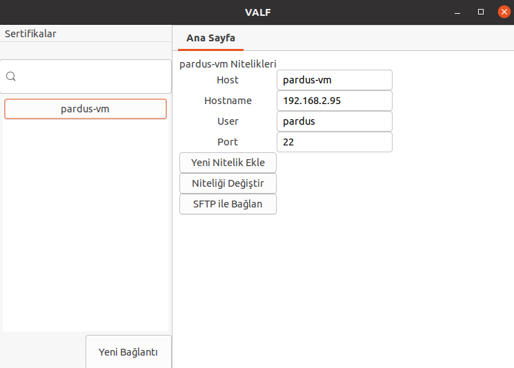

## [TR](#TR) | [EN](#EN)
###### TR
# VALF 

Valf, tamamen açık kaynaklı olarak, Sistem Yöneticileri düşünülerek tasarlanmış bir uzaktan yönetim aracıdır.

➤ Valf,

* Uzak sunucularınızı ve onların kayıtlı niteliklerini görebilmenizi,
* Yeni sunucular ekleyebilmenizi, var olanları silebilmenizi,
* Bağlantılara yeni nitelikler ekleyebilmenizi, silebilmenizi,
* Nitelikleri değiştirebilmenizi,
* Oluşturulmuş SSH sertifikalarınızı görebilmenizi,
* Herkese açık anahtarları arayüz üzerinden görüntüleyebilmenizi,
* Yeni sertifikalar ekleyebilmenizi, var olanları silebilmenizi,
* Sertifikalarınızı seçtiğiniz sunuculara göndermenizi,
* Tanımladığınız sertifikaları silebilmenizi,
* Arayüz üzerinde açılan bir terminal ile tek tıkla SSH bağlantısı kurabilmenizi,
* SCP protokolünü kullanarak yerel bilgisayarınızdaki dosyalarınızı uzak sunucularınızın /home/user dizinine gönderebilmenizi,
* SFTP protokolünü kullanarak dinamik olarak hem yerel hem de uzak sunucularınızın dosya dizinlerinde gezinebilmenizi,
* Görsel arayüz içerisinde **'Sürükle-Bırak'** ile yerel dosyalarınızı/dizinlerinizi uzak sunucularınıza gönderebilmenizi sağlar.

➤ Ayrıca SSH sertifikalarınızı uzak sunucularınıza tanımlanamanız veya halihazırda tanımlamış olmanız sayesinde Valf sizden,

* SSH bağlantısı kurarken,
* SFTP protokolü ile dosya aktarırken parola girmenizi beklemez.

## Fonksiyonlar

Valf yapısı ve amacı gereği birden fazla alanda Sistem Yöneticilerine kolaylık sağladığından birden fazla alanda ayrı fonksiyonlara sahiptir. 

**Bu fonksiyonlardan hiçbiri bilgilerinizi yerel makinenize veya uzak sunuculara kaydetmez/depolamaz. Valf kapandığında değişkenlerde tutulan tüm değerler bir daha görünmemek üzere silinir.**

## Bağlantı Fonksiyonları

* [Bağlantıları ve özelliklerini arayüzde görmek](#Bağlantıları-ve-Özelliklerini-Arayüzde-Görmek)
* [Yeni bağlantı eklemek](#Yeni-Bağlantı-Eklemek)
* [Bağlantı silmek](#Bağlantı-silmek)
* [Bağlantıya yeni nitelik eklemek](#Bağlantıya-Yeni-Nitelik-Eklemek)
* [Bağlantı niteliklerini silmek](#Bağlantı-niteliklerini-silmek)
* [Bağlantı niteliklerini düzenlemek](#Bağlantı-niteliklerini-düzenlemek)
## Sertifika Fonksiyonları

* [Sertifika ve açık anahtarlarını görüntülemek](#Sertifika-ve-Açık-Anahtarlarını-Görüntülemek)
* [Yeni sertifika eklemek](#Yeni-sertifika-eklemek)
* [Sertifika silmek](#Sertifika-Silmek)
* [Sertifikaları sunuculara tanımlamak](#Sertifikaları-sunuculara-tanımlamak)
* [Tanımlı sertifikaları silmek](#Tanımlı-sertifikaları-silmek)
## Bağlantı Kurma ve Dosya Aktarım Fonksiyonları

* [SSH bağlantısı kurmak](#SSH-bağlantısı-kurmak)
* [SCP ile dosya transferi yapmak](#SCP-ile-dosya-transferi-yapmak)
* [SFTP ile yerel makine/uzak sunucu dosya sistemlerinde gezmek](#SFTP-ile-yerel-makine/uzak-sunucu-dosya-sistemlerinde-gezmek)
* [SFTP ile dosya/dizin transferi yapmak](#SFTP-ile-dosya/dizin-transferi-yapmak)

## Ek Başlıklar

* [Katkıda bulunmak isteyenler için](#Katkıda-bulunmak-isteyenler-için)
* [Test edilen dağıtımlar](#Test-edilen-dağıtımlar)
* [Lisans](#Lisans)

## Fonksiyonların Kullanımı ve Detaylı Açıklamaları
## Bağlantı Fonksiyonları

## Bağlantıları ve Özelliklerini Arayüzde Görmek

Valf tüm yönleriyle kullanıcılarına sadelik ve kolaylık sunma amacı ile tasarlanmıştır. Bu sebepten ötürü temel amacımızın yapı taşı olan uzak sunucularınız sürekli olarak arayüzün sol tarafında sergilenir. Bu sunucuların üzerinde iki adet etkide bulunabilirsiniz. 

Sol tıkladığınızda arayüzün kalan kısmında sunucu özellikleriniz yer alır. **Burada herhangi bir kural yoktur. Önceden kaydettiğiniz sunucu nitelikleriniz istediği sırayla burada yer alabilir. Valf, satır aralarında boşluk veya satır sıralarının nizami olmasını gözetmez.**

Sağ tıkladığınızda ise sunucu üzerinde gerçekleştirebileceğiniz diğer etkilerden bir kaçı sizi karşılar. Bu özelliklerin tamamı çalıştırılabilir yapıdadır ve ileriki başlıklarda anlatılacaktır.

**Valf'i başlattığınızda eğer daha önce hiç SSH bağlantısı kurmamışsanız /home/user dizininizin altına /.ssh/ dizinini ve altında bulunması gereken authorized_keys, config, known_hosts dosyalarını oluşturur.**

## Yeni Bağlantı Eklemek

Yeni bağlantı eklemek için sadece temel değerlere sahip olmanız yeterli. Valf, arayüze girdiğiniz bağlantınıza vereceğiniz ad, IP ve kullanıcı adı bilgilerini sizin yerinize sistemli bir şekilde .ssh/config dosyanıza kaydeder. Sonrasında da onlara tek tıkla ulaşmanızı sağlar.

## Bağlantı Silmek

Artık kullanmadığınız sunucuların config dosyanızda yer kaplamasına gerek yok ! Ya da onları bulmak için gözlerinizi bozmanıza. Valf ile yalnızca sunucu adına sağ tıklayarak açtığınız pencereden Bağlantıyı Sil'i seçmeniz yeterli. O sizin için istediğiniz sunucuyu ve ona ait tüm özellikleri saliseler içerisinde dosyanızdan siler.

## Bağlantıya Yeni Nitelik Eklemek

Sunucunuza yeni nitelikler eklemek hiç bu kadar kolay olmamıştı ! İstediğiniz değeri istediğiniz sunucunuza anında ekleyebilirsiniz. Valf sizin için config dosyanızda alakalı sunucunun en son satırına bu değeri kaydeder ve karşılığında sizden hiçbir şey beklemez. 

## Bağlantı Niteliklerini Silmek

Yeni nitelikler eklemek kadar bu nitelikleri silmek de meziyet ister. Valf, artık kullanmadığınız ya da geçersiz hale gelen sunucu niteliklerinizi config dosyanızdan siler ve arkasında hiç iz bırakmaz.

## Bağlantı Niteliklerini Düzenlemek

Sunucu IP'nizi yanlış mı yazdınız ? Durun, çaresizlikle terminali açıp bir rakam için bir ton işlem yapmanıza gerek yok. Valf ile arayüz üzerinde istediğiniz nitelikteki istediğiniz değeri değiştirin, değişiklikten sonra 'Niteliği Değiştir' butonuna tıklasanız yeterli. Gerisini Valf'e bırakın.

## Sertifika Fonksiyonları

## Sertifika ve Açık Anahtarlarını Görüntülemek

Sertifikalarım menüsüne tıklayarak mevcut sertifikalarınızı görebilir, üstlerine sol tıklayarak açık anahtarlarını görüntüleyebilir, kopyalayabilirsiniz.

## Yeni Sertifika Eklemek

Hiç sertifikanız olmayabilir, ya da her sunucuya ayrı sertifika göndermek istiyor olabilirsiniz. Valf açısından sorun yok. Yeni sertifika oluşturma özelliği sayesinde istediğiniz ad ve parolada yeni bir sertifika oluşturabilirsiniz. Eğer parola girmezseniz parolasız, ad girmezseniz default adında, her ikisini de girmezseniz hem default adda hem de parolasız bir sertifika oluşturabilirsiniz. Hangisini yapacağınızı seçmek tamamen size kalmış !

## Sertifika Silmek

Kullanmadığınız ya da parolasının/gizli anahtarının ele geçirilmiş olabileceğinizi düşündüğünüz sertifikaları sadece sağ tıklayarak makinenizden silebilirsiniz. (Bu fonksiyon sadece ana makineden silme işlemi yapar.)

## Sertifikaları Sunuculara Tanımlamak

İşte Valf'in sertifikalar konusundaki asıl olayı. Sertifikanız üzerine sağ tıklayın. Sertifikayı gönder'i seçin. İstediğiniz sunucuyu seçin, parolasını girin ve işte oldu ! Artık SSH ile parolasız bağlantı kurabilir ve SFTP ile parolasız sunucunuza bağlanıp istediğiniz kadar dosya/dizin aktarabilirsiniz !

## Tanımlı Sertifikaları Silmek

Sunucularınıza gönderdiğiniz bir sertifikada güvenlik açığı oluşturabilecek bir durum yaşadınız veya artık o sunucuya erişmenize gerek yok. Durum her ne olursa olsun günün birinde uzak sunucularınızdan birinden sertifikanızı silmek isteyebilirsiniz. Tanımlı sertifika silmek istediğiniz sunucunuza sağ tıklayıp sertifikanızı silin ve sunucu ile olan ilişkinizi tek seferde kesip atın !

## Bağlantı Kurma ve Dosya Aktarım Fonksiyonları

Bu başlık altında listelenen fonksiyonlar hem SSH sertifikası tanımlanmış sunucular için hem de tanımlanmamış sunucular için iki farklı durum da göz önünde bulundurularak açıklanacaktır.

## SSH Bağlantısı Kurmak

* Eğer SSH sertifikası tanımlanmışsanız, işiniz herkesten kolay. Bağlanmak istediğiniz sunucuya sağ tıklayın, Bağlan'ı seçin. Arayüz üzerinden sunucu yönetimi yapmanın ne kadar keyifli olduğunu farkedin ve bunun tadını çıkarın.

* Eğer SSH sertifikası tanımlamamışsanız (ki tanımlamanın dünyayı daha güzel bir yer haline getireceği kesindir), bağlanmak istediğiniz sunucuya sağ tıklayın, Bağlan'ı seçin, parolanızı girin ve Valf'in tadını çıkarın.

## SCP ile Dosya Transferi Yapmak

**Not : Valf henüz bu fonksiyon için SSH sertifikanız olup olmadığını kontrol etmiyor. Eğer buna bir dur demek isterseniz pull request taleplerine her zaman açığız.**

SCP ile SFTP yeni sunucular açtığınızda en büyük destekçileriniz, bunun farkındayız. Tabii Valf de öyle. Eğer dosyalarınızı SCP vasıtası ile aktarmak isterseniz sunucunuza sağ tıklayıp Scp ile dosya aktar'ı seçin. Parolanızı girin ve sürekli açık olacak Dosya Seç butonuna tıklayıp göndermek istediğiniz dosyayı seçin. Seçtiğiniz dosya saniyeler içerisinde uzak sunucunuzun /home/user dizininde belirecek !

## SFTP ile Yerel Makine/Uzak Sunucu Dosya Sistemlerinde Gezmek

**Not: Burada her arama sayfadaki fonksiyonları tekrar çağırarak sıfırlanmasına sebep olmaktadır. Eğer buna bir dur demek isterseniz pull request taleplerine açığız.**

* Eğer SSH sertifikası tanımlamışsanız, sunucunuza sol tıklayıp, sağ tarafta yer alan SFTP ile bağlan butonuna basın. Karşınızda iki sunucunun da /home/user dizinlerinden başlayan dosya sistemlerini bulacaksınız. Üstlerinde yer alan arama kısımları işte bu başlığın olayı. Eğer daha üst veya alt dizinleri ağaç yapısında aramadan direk geçiş yapmak istiyorsanız buraya istediğiniz dizini yazın. Dizinleme işlemi verdiğiniz noktadan başlayacaktır. 

* Eğer SSH sertifikası tanımlamamışsanız, sunucunuza sol tıklayıp, sağ tarafta yer alan SFTP ile bağlan butonuna basın, gelen parola penceresine parolanızı girin. Karşınızda iki sunucunun da /home/user dizinlerinden başlayan dosya sistemlerini bulacaksınız. Üstlerinde yer alan arama kısımları işte bu başlığın olayı. Eğer daha üst veya alt dizinleri ağaç yapısında aramadan direk geçiş yapmak istiyorsanız buraya istediğiniz dizini yazın. Dizinleme işlemi verdiğiniz noktadan başlayacaktır. 

## SFTP ile Dosya/Dizin Transferi Yapmak

Valf'in en önemli ve en kolaylık sağlayan özelliği, SFTP ile dosya veya dizin transferi yapmak. Bu büyülü özellik sayesinde artık sancılı dosya transferi yapma süreçlerine son verebilirsiniz. Çünkü Valf sizin için en kolay hale getiriyor.

* Eğer SSH sertifikası tanımlamışsanız, sunucunuza sol tıklayıp, sağ tarafta yer alan SFTP ile bağlan butonuna basın. Karşınızda iki sunucunun da /home/user dizinlerinden başlayan dosya sistemlerini bulacaksınız. Bu dosya ağaçları isterseniz yukarıdaki başlıkta anlatıldığı üzere istediğiniz noktadan başlatın, istediğiniz dosya/dizini karşı makinedeki istediğiniz yola **sürükleyip bırakın**. İşte bu kadar, siz ne olduğunu anlamadan gönderikleriniz çoktan karşı tarafta belirmiş olacak !

* Eğer SSH sertifikası tanımlamamışsanız, sunucunuza sol tıklayıp, sağ tarafta yer alan SFTP ile bağlan butonuna basın, gelen parola penceresine parolanızı girin. Karşınızda iki sunucunun da /home/user dizinlerinden başlayan dosya sistemlerini bulacaksınız. Bu dosya ağaçları isterseniz yukarıdaki başlıkta anlatıldığı üzere istediğiniz noktadan başlatın, istediğiniz dosya/dizini karşı makinedeki istediğiniz yola **sürükleyip bırakın**. İşte bu kadar, siz ne olduğunu anlamadan gönderikleriniz çoktan karşı tarafta belirmiş olacak !

# Katkıda Bulunmak İsteyenler İçin

README dosyası boyunca anlatılan özellikler içerisinde Valf'de olmasını istediğimiz ancak çeşitli faktörler sebebi ile eklenemeyen bazı özelliklere yer verilmiştir. Katkıda bulunmak isteyen Açık Kaynak Gönüllüleri Valf'e öncelikle bu noktalardan destek verebilirler.

# Test Edilen Dağıtımlar

* Pardus 19.03 XFCE
* Ubuntu 20.04

*Not: Burada yer almayan bir sürümde Valf'i sorunsuz kullanabiliyorsanız lütfen bize bildirin.*

# Lisans

Bu depo MIT lisansı ile lisanslanmıştır.

###### EN
# Valf 

Valf is a completely open source remote management tool designed with System Administrators in mind.

Valf allows you to,

- See your remote servers and their registered attributes,
- Add new servers, delete existing ones,
- Add new attributes to link, delete them,
- Change the attributes,
- See your created SSH certificates,
- View public keys through the interface,
- Add new certificates, delete existing ones,
- Send your certificates, delete existing ones,
- Delete the certificates you have defined,
- One click SSH connection with a terminal opened on the interface,
- Send your files on your local computer to the home/user directory of your remote servers through using the SCP protocol,
- Dynamically browse the file directories of both local and remote servers through using SFTP protocol,
- Send your local files / directories to your remote servers with **'Drag-Drop'** on the visual interface.

➤ In addition, since you have defined your SSH certificates to your remote servers or you have already defined, Valf does not expect you to enter a password,

- While establishing an SSH connection,
- While transferring files with SFTP protocol.

## Functions

Valf has separate functions in more than one area as it provides convenience to System Administrators in more than one are due to its structure and purpose.

**Non of this functions save/store your information on your local device or remote servers. When Valf closed all the values kept in the variables are deleted without ever being seen again.**

## Host Functions

* [Viewing hosts and properties on the interface](#Viewing-Hosts-and-Their-Properties-on-the-Interface)
* [Adding new host](#Adding-new-host)
* [Deleting a host](#Deleting-a-host)
* [Adding new attribute to a host](#Adding-new-attribute-to-a-host)
* [Deleting host attributes](#Deleting-host-attributes)
* [Editing host attributes](#Editing-host-attributes)
## Certificate Functions

* [Viewing certificates and their public keys](#Viewing-certificates-and-their-public-keys)
* [Adding a new certificate](#Adding-a-new-certificate)
* [Deleting a certificate](#Deleting-a-certificate)
* [Defining certificates to servers](#Defining-certificates-to-servers)
* [Deleting defined certificates](#Deleting-defined-certificates)
## Establishing Connection and File Transfer Functions

* [Establishing an SSH connection](#Establishing-an-SSH-connection)
* [Transferring files with SCP](#Transferring-files-with-SCP)
* [Navigating local machine / remote server file systems with SFTP](#Navigating-local-machine-/-remote-server-file-systems-with-SFTP)
* [Transferring files / directories with SFTP](#Transferring-files-/-directories-with-SFTP)

## Additional Topics

* [For contributers](#For-contributers)
* [Tested distributions](#Tested-distributions)
* [License](#License)

## Usage of Functions and Detailed Explanations
## Host Functions

## Viewing Hosts and Their Properties on the Interface

Valf has been designed with the aim of offering simplicity and convenience to its users in all aspects. For this reason, your remote servers, which are the building blocks of our main purpose, are constantly displayed on the left side of the interface. You can have two effects on these servers.

When you left click, your server properties are on the rest of the interface. **There are no rules here. There are no rules here. Your previously saved server attributes can be found here in any order. Valf does not observe the spacing between the lines or regular rows of lines.**

When you right click, some of the other effects you can have on the server meet you. All of these features are executable and will be explained in the following titles.

**When you start Valf, it creates the /.ssh/ directory under your / home / user directory and the authorized_keys, config, known_hosts files that should be located under it if you have never made an SSH connection before.**

## Adding New Host

To add new links, you just need to have the core values. Valf systematically saves the name, IP and username information you will give to your connection that you enter into the interface in your .ssh / config file. It then allows you to reach them with one click.

## Deleting a Host

Servers that you no longer use do not need to take up space in your config file! Or mess your eyes to find them. With Valf, you just right click the server name and select Delete Connection from the window you open. It will delete the server you want for you and all its features from your file within milliseconds.

## Adding New Attribute to a Host

Adding new attributes to your server has never been that easy! You can instantly add the value you want to your server. Valf saves this value for you in the last line of the relevant server in your config file and does not expect anything from you in return.

## Deleting Host Attributes

It takes skill to delete them as well as adding new ones. Valf removes any server attributes you no longer use or have become invalid from your config file and leaves no traces behind.

## Editing Host Attributes

Did you mistype your server IP? Wait, you don't desperately need to open the terminal and make tons of transactions for a number. Change the desired value of the property you want on the interface with Valf, after the change, just click the 'Change Attribute' button. Leave the rest to Valf.

## Certificate Functions

## Viewing Certificates and Their Public Keys

You can view your existing certificates by clicking on the My Certificates menu, view and copy their public keys by left clicking on them.

## Adding a New Certificate

You may not have any certificates, or you might want to send a separate certificate to each server. No problem in terms of Valf. With the new certificate creation feature, you can create a new certificate with the name and password you want. No problem in terms of Valf. With the new certificate creation feature, you can create a new certificate with the name and password you want. If you do not enter a password without password, if you do not enter a name without name and if you do not enter both, you can create a certificate with both the default name and no password. It is up to you to choose which one to do!

## Deleting a Certificate

You can delete certificates from your machine that you do not use or that you think their password / secret key may be compromised by simply right-clicking. (This function only deletes from the main machine.)

## Defining Certificates to Servers

Here is Valf's main thing about certifications. Right click on your certificate. Select Send certificate. Select the server you want, enter its password and you're done! You can now connect with SSH without a password and connect to your server with SFTP without a password and transfer as many files / directories as you want!

## Deleting Defined Certificates

You have experienced a situation that could create a security vulnerability in a certificate you send to your servers or you no longer need to access that server. Regardless of the situation, you may want to delete your certificate from one of your remote servers one day. Right click on the server whose defined certificate you want to delete, delete your certificate and cut off your contact with the server easily!

## Establishing Connection and File Transfer Functions

The functions listed under this heading will be explained both for servers with defined SSH certificates and for undefined servers, by considering two different situations.

## Establishing an SSH Connection

- If you have the SSH certificate defined, your job is easier than anyone else. Right click the server you want to connect to, select Connect. Realize how enjoyable it is to manage a server through the interface and enjoy it.

- If you haven't defined an SSH certificate (which is sure to make the world a better place), right click on the server you want to connect to, select Connect, enter your password and enjoy Valf.

## Transferring Files With SCP

**Not : Note: Valf does not yet check if you have SSH certification for this function. If you want to call it a stop, we are always open to pull requests.**

When you open new servers with SCP, SFTP are your biggest supporters, we are aware of this. Of course Valf is too. If you want to transfer your files via SCP, right click on your server and select Transfer file with Scp. Enter your password and click the "Select File" button that will be open continuously and select the file you want to send. The file you selected will appear in your remote server's / home / user directory in seconds!

## Navigating Local Machine / Remote Server File Systems With SFTP

**Not: Note: Here, each search causes the functions on the page to be reset by calling them again. If you want to call it a stop, we are open to pull requests.**

- If you have defined an SSH certificate, left click on your server and click the Connect with SFTP button on the right. You will find the file systems of both servers starting from the / home / user directories. The search parts above them are the thing of this title. If you want to switch directly without searching the higher or lower directories in the tree structure, type the directory you want here. The indexing process will start from the point you provided.

- If you have not defined an SSH certificate, left click on your server and click the Connect with SFTP button on the right, enter your password in the incoming password window. You will find the file systems of both servers starting from the / home / user directories. The search parts above them are the thing of this title. If you want to switch directly without searching the higher or lower directories in the tree structure, type the directory you want here. The indexing process will start from the point you provided.

## Transferring Files / Directories With SFTP

The most important and easiest feature of Valf is to transfer files or directories with SFTP. With this magical feature, you can put an end to painful file transfer processes. Because Valve makes it with the easiest way for you.

- If you have defined an SSH certificate, left click on your server and click the Connect with SFTP button on the right. You will find the file systems of both servers starting from the / home / user directories. If you want start these file trees, from the point you want as described in the title above, **drag and drop** the file / directory you want to the path you want on the opposite machine. That's it! Your posts will already appear on the opposite side before you know what happened!

- If you have not defined an SSH certificate, left click on your server and click the Connect with SFTP button on the right, enter your password in the incoming password window. You will find the file systems of both servers starting from the / home / user directories. If you want these file trees, start from the point you want as described in the title above, **drag and drop**  the file / directory you want to the path you want on the opposite machine. That's it, your posts will already appear on the opposite side before you know what happened!

# For Contributers

Among the features explained throughout the README file, there are some features that we want in the Valve but cannot be added for various reasons. Open Source Volunteers who want to contribute can primarily support Valve from these points.

# Tested Distributions

* Pardus 19.03 XFCE
* Ubuntu 20.04

*Note: Please let us know if you can use Valve without problems on a version not mentioned here.*

# Licence

This repository is licensed under the MIT license.

*Not: Dosyanın İngilizceye çevirisi Etem Yürek tarafından gönüllü olarak katkı sağlamak amacı ile yapılmıştır.*
